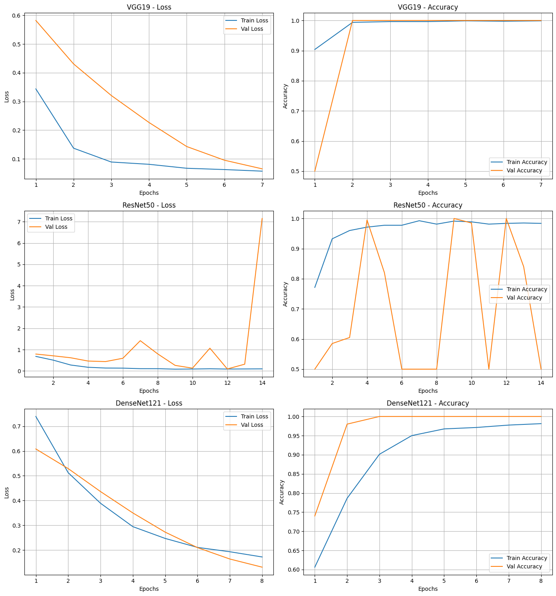

# Industrial Maintenance CNN Comparison

A comparative study of modern Convolutional Neural Networks (CNNs) for industrial predictive maintenance applications.

## Overview

Predictive maintenance aims to detect machine degradation before failures occur, reducing downtime and maintenance costs in industrial environments.

In this project, three state-of-the-art deep learning architectures were evaluated and compared:

- VGG19
- ResNet50
- DenseNet121

The objective was to analyze their learning behavior, convergence stability, and feature extraction capabilities on an industrial image classification task.

---

## Motivation

Deep learning has become a key technology for industrial monitoring and fault detection. However, selecting the right architecture is not always straightforward.

This project investigates how different CNN designs impact:

- Training stability
- Validation performance
- Parameter efficiency
- Generalization capability

Understanding these trade-offs is essential before deploying deep learning models in predictive maintenance systems.

---

## Architectures Evaluated

### VGG19
A classical deep convolutional network based on stacked convolutional layers. Known for its simplicity and strong feature extraction capabilities, but computationally expensive.

### ResNet50
Introduces residual (skip) connections that improve gradient flow and facilitate training of deeper networks.

### DenseNet121
Uses dense connectivity between layers, promoting feature reuse and improving parameter efficiency while maintaining strong performance.

---

## Dataset

The experiments were conducted on a synthetic industrial dataset designed for educational and benchmarking purposes.

> **Note:** Since the dataset is synthetic and relatively simple, the models achieved exceptionally high validation accuracies. These results should not be interpreted as representative of real industrial environments, where data is significantly noisier and more complex.

---

## Experimental Results

The training and validation curves reveal distinct behaviors across architectures:

| Model | Observations |
|---------|------------|
| VGG19 | Stable convergence and strong overall performance |
| ResNet50 | Fast learning but unstable validation behavior |
| DenseNet121 | Best balance between stability, efficiency, and accuracy |

### Key Findings

- VGG19 achieved excellent predictive performance.
- ResNet50 converged rapidly but exhibited unstable validation metrics.
- DenseNet121 provided the most consistent learning dynamics.
- Dense connectivity proved highly effective for feature reuse and parameter efficiency.

---

## Technologies Used

- Python
- TensorFlow / Keras
- NumPy
- Matplotlib
- Scikit-Learn
- Jupyter Notebook

---

## Application to Predictive Maintenance

The insights gained from this study extend beyond image classification.

Modern CNN architectures can serve as powerful feature extractors in industrial monitoring pipelines. Combined with temporal models such as LSTMs or Transformers, they can contribute to:

- Fault detection
- Anomaly detection
- Equipment health monitoring
- Remaining Useful Life (RUL) prediction

A potential future pipeline could leverage CNN-based feature extraction followed by sequence modeling to capture machine degradation patterns over time.

---

## Future Work

- Evaluation on real industrial datasets
- CNN-LSTM hybrid architectures
- Transformer-based predictive maintenance models
- Remaining Useful Life (RUL) estimation
- Model deployment and monitoring pipelines

---

## Results Preview

---

## Authors

- **Nizar Baloubali** (Data Science, Big Data & AI Engineering student)
- **Manal ES-SOBHY** (Data Science, Big Data & AI Engineering student)

---

## License

This project is licensed under the MIT License.